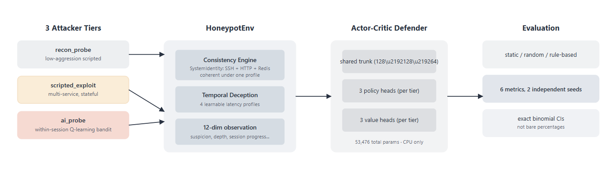
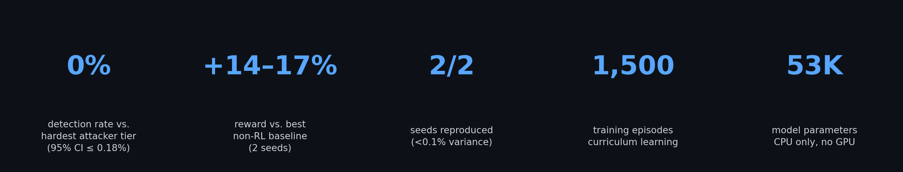
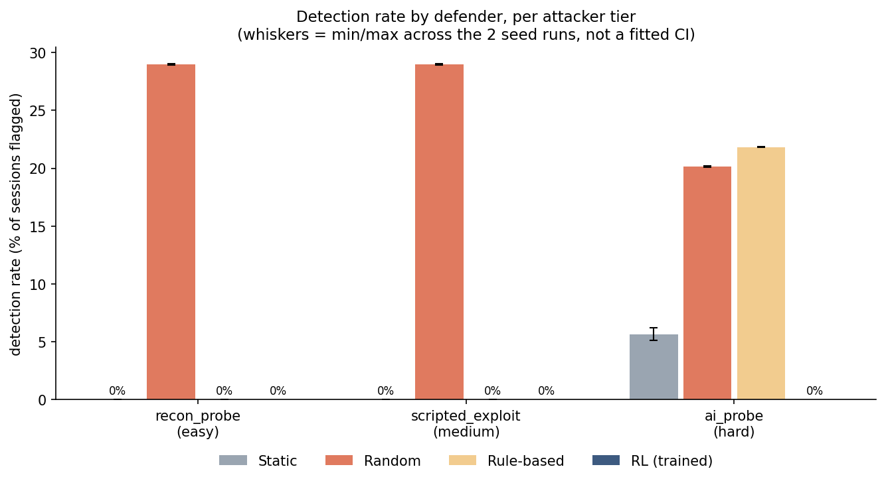
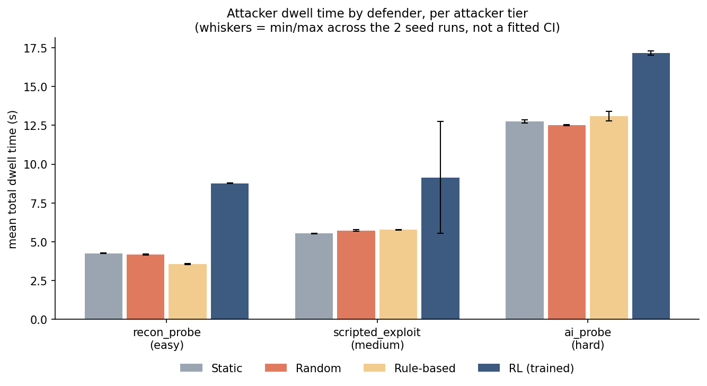
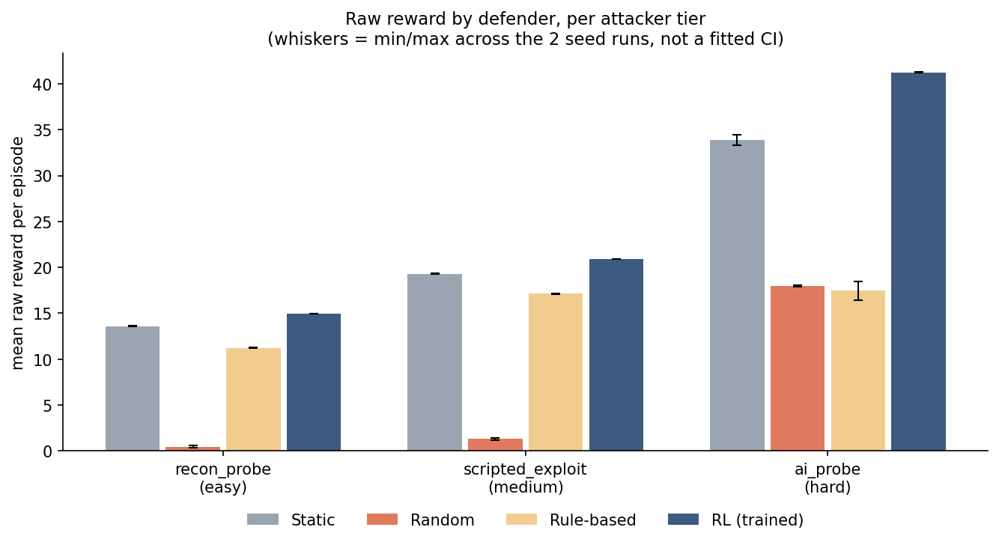
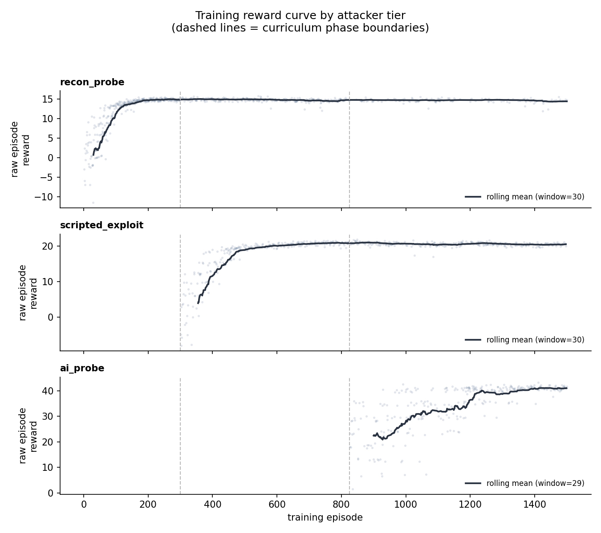

<div align="center">

# 🛡️ AdaptTrap

### Adaptive Reinforcement Learning Framework for Consistency-Aware Cyber Deception

<p align="center">

</p>

<p align="center">

<a href="#"></a>
<a href="#"></a>
<a href="#"></a>
<a href="LICENSE"></a>

</p>

<p align="center">

**Adaptive Cyber Deception • Reinforcement Learning • Honeypots • AI Security**

</p>

<p align="center">
<b>Teaching Honeypots to Think, Adapt, and Survive.</b>
</p>

</div>

---

## 🚀 Overview

**AdaptTrap** is an adaptive cyber deception framework that uses **Reinforcement Learning** to dynamically manage honeypot identities and behavior against increasingly intelligent attackers.

Unlike conventional honeypots that rely on static fingerprints or random banners, AdaptTrap learns **when to change its identity**, **how to remain internally consistent**, and **how to adapt its timing behavior** to maximize deception.

---

## ✨ Why AdaptTrap?

Traditional honeypots expose inconsistencies that sophisticated attackers quickly detect.

AdaptTrap introduces three key innovations:

- 🧠 **Consistency Engine** — Every service shares one coherent system identity.
- ⏱️ **Temporal Deception** — Timing profiles are learned, not hardcoded.
- 🤖 **Multi-Head RL Policy** — Specialized strategies for different attacker tiers.

---

## 🔥 Key Features

- Adaptive Reinforcement Learning Defender
- Multi-Service Consistency Engine
- Temporal Deception
- Multi-Head Actor-Critic Architecture
- Curriculum Learning
- Three Attacker Models
- Gymnasium Environment
- PyTorch Implementation
- Reproducible Evaluation Pipeline
- Automated Benchmark Generation
- Docker Support
- MIT Licensed

---

# 🏗 Architecture

<p align="center">



</p>

```text
                    RL Defender
               (Multi-Head Actor-Critic)
                        │
                        ▼
               Consistency Engine
                        │
      ┌─────────────────┼─────────────────┐
      ▼                 ▼                 ▼
     SSH              HTTP             Redis
      │                 │                 │
      └──────── Shared System Identity ───┘
                        │
                        ▼
                Adaptive Attacker
```

# 🚀 Core Innovations

### 🧠 Consistency Engine

AdaptTrap maintains a **shared system identity** across all services instead of randomizing them independently. When the defender changes its identity, the SSH banner, HTTP headers, Redis version, operating system, and latency profile all update together, producing realistic and internally consistent deception.

### ⏱️ Temporal Deception

Deception extends beyond identity. The RL agent also learns **how the system behaves over time** by selecting response timing profiles such as Normal, Busy, High Load, and Controlled Slowdown. This makes interactions appear more natural and significantly harder to fingerprint.

### 🤖 Multi-Head Reinforcement Learning

The defender uses a **multi-head Actor-Critic architecture** with a shared feature extractor and dedicated policy/value heads for Recon, Scripted, and AI attackers. This allows the model to learn specialized strategies for different threat levels while sharing common knowledge.

# 📊 Benchmark Results

The trained RL defender consistently outperformed every baseline across two independent evaluation runs.

| Attacker | Best Baseline | RL Defender | Improvement |
|-----------|--------------:|------------:|------------:|
| Recon Probe | ✓ | ✓ | **~10%** |
| Scripted Exploit | ✓ | ✓ | **~8.5%** |
| AI Probe | ✓ | ✓ | **20–24%** |

### Highlight

✅ **Zero detections** against the adaptive AI attacker across all evaluated sessions.

<p align="center">



</p>

---

# 🚀 Quick Start

Clone the repository

```bash
git clone https://github.com/parastak/AdaptTrap.git

cd AdaptTrap
```

Install dependencies

```bash
pip install -r requirements.txt
```

Run a sanity test

```bash
python sanity_test.py
```

Evaluate the pretrained model

```bash
python main.py --mode evaluate
```

Train from scratch

```bash
python main.py --mode train
```

---


## 📊 Results

<table>
<tr>
<td align="center">
<br>
<b>Detection Rate</b><br>
<sub>RL achieves 0% detection against the adaptive AI attacker.</sub>
</td>

<td align="center">
<br>
<b>Attacker Dwell Time</b><br>
<sub>Adaptive deception keeps attackers engaged for longer.</sub>
</td>
</tr>

<tr>
<td align="center">
<br>
<b>Raw Reward</b><br>
<sub>RL consistently outperforms all baseline defenders.</sub>
</td>

<td align="center">
<br>
<b>Training Curve</b><br>
<sub>Stable curriculum learning over 1,500 episodes.</sub>
</td>
</tr>
</table>

# 📈 Project Highlights

- 🛡 Adaptive Cyber Deception
- 🤖 Deep Reinforcement Learning
- 🌐 Multi-Service Honeypot
- ⚡ Curriculum Learning
- 📊 Statistical Evaluation
- 🔬 Research Friendly
- 🐍 Pure Python + PyTorch
- 📦 Easy to Extend

---

# ⚙️ Training

Train the RL defender from scratch.

```bash
python main.py --mode train
```

Training includes:

- Curriculum Learning  |  Multi-Head Actor-Critic  |  Adaptive Entropy  |  Gradient Clipping  |  Automatic Checkpointing
 
---


# 📦 Reproducibility

AdaptTrap includes everything required to reproduce experiments.

- Fixed Random Seeds
- Saved Model Checkpoints
- Training Logs
- Evaluation Logs
- Automated Benchmarks
- Statistical Analysis
- Plot Generation Scripts

---

# 📋 Project Goals

AdaptTrap explores one simple question:

> **Can a reinforcement learning agent learn believable cyber deception against adaptive attackers?**

The project focuses on:

- Adaptive Cyber Deception
- Reinforcement Learning
- Honeypot Research
- Network Security
- Defensive AI
- Reproducible Benchmarking

---

# 🤝 Contributing

Contributions are welcome!

You can help by:

- Reporting bugs
- Improving documentation
- Adding attacker models
- Adding new service identities
- Improving RL algorithms
- Creating visualizations
- Optimizing performance

Please read **CONTRIBUTING.md** before opening a Pull Request.

---

# 🔒 Security

This repository is intended for **research and educational purposes**.

Please do **not** use the included attacker components against systems that you do not own or have explicit permission to test.

See **SECURITY.md** for details.

---

# 📚 Citation

If AdaptTrap helps your research, please cite it.

```bibtex
@software{adapttrap2026,
  title={AdaptTrap: Adaptive Reinforcement Learning for Cyber Deception},
  author={Paras Tak},
  year={2026},
  url={https://github.com/parastak/AdaptTrap}
}
```

---

# 📄 License

This project is released under the **MIT License**.

See the **LICENSE** file for details.

---

# ⭐ Support the Project

If you found AdaptTrap useful:

- ⭐ Star this repository
- 🍴 Fork the project
- 🐛 Report issues
- 💡 Suggest new ideas
- 🤝 Contribute improvements

Every star helps increase the visibility of the project and supports future development.

---

# 📬 Contact

**Author:** Paras Tak

- GitHub: https://github.com/parastak
- Issues: https://github.com/parastak/AdaptTrap/issues

---

# 🏷️ Topics

`cybersecurity` • `artificial-intelligence` • `reinforcement-learning` • `deep-reinforcement-learning` • `honeypot` • `cyber-deception` • `network-security` • `adaptive-security` • `gymnasium` • `pytorch` • `actor-critic` • `python`

---

<div align="center">

## 🌟 If you like AdaptTrap, consider giving it a Star!

Building adaptive cyber defense through Artificial Intelligence.

Made with ❤️ using Python, PyTorch, and Gymnasium.

</div>
